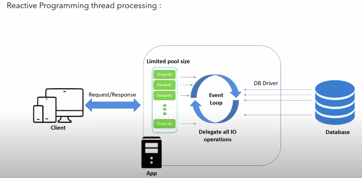

### Some Benefits of Reactive Programming
We can achieve proper CPU utilization, there is no application downtime, and the flow of execution 
can be concurrent because it supports asynchronous and non-blocking operations. Additionally, 
it streams the data efficiently by utilizing the publisher and subscriber model.

### Reactive Programming Thread Processing :
 

In reactive programming, when a request comes to the application, it is assigned to a thread. 
The advantage here is that the thread does not wait for the response back from the database. 
Instead, it sends an event to the database, informing it that it won't wait any longer and 
that it should process the request whenever it's ready. Once the database has the response ready,
it assigns that response to an available thread and publishes a completion event. In this approach,
the thread is completely free and can accept numerous requests because not a single thread is blocking.
Asynchronous, non-blocking requests are assigned to particular threads, allowing the threads to handle 
multiple requests simultaneously. This is how we can handle a large number of concurrent requests with
a relatively small number of threads. That's the essence of reactive programming.

### BackPressure On Data Streams

Consider a scenario where the database returns a large volume of data as a response. In such cases, 
traditional REST APIs lack a back pressure feature, which can lead to issues like application crashes
due to out-of-memory errors. However, reactive programming introduces the concept of back pressure. 
With back pressure, if the database overwhelms the application with a huge amount of data, the application 
can instruct the database to slow down the response, allowing it to process the available data before accepting 
more. This back pressure support is specifically applicable to reactive programming, and it can also be configured 
in the database driver to limit the amount of data expected. By leveraging back pressure, it becomes possible
to control the data flow, ensuring that the application can handle the workload without being overwhelmed.